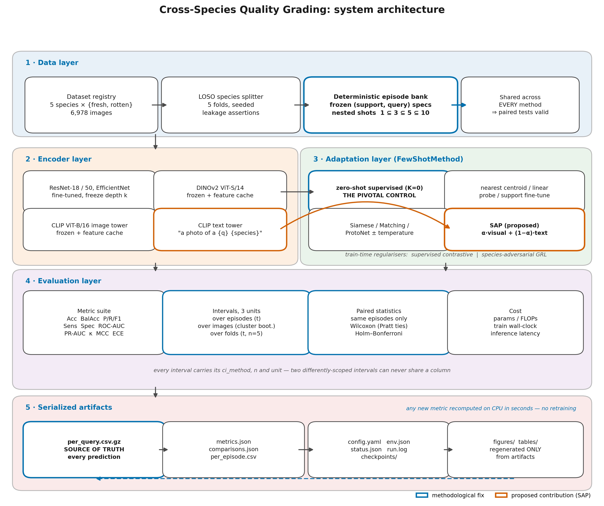

# Cross-Species Quality Grading

**A few-shot benchmark for fruit quality assessment on unseen species**
Amr Samir — Master's Thesis, 2026

---

## Research question

> Can a model trained to grade quality (fresh vs. rotten) on some fruit species
> generalise to **species it has never seen**, and **how much does few-shot
> adaptation actually contribute** over direct transfer?

The second half of that question is the one this repository is built to answer
honestly. Because the label set (`fresh` / `rotten`) is *fixed* across species
and only the species changes, nothing about the task logically requires a
support set. So the benchmark leads with the control that settles it:
`zeroshot_supervised` — a plain binary classifier trained on the seen species
and applied to the unseen one with **zero target labels**.

## The task: CSQG

Under Cross-Species Quality Grading the **label semantics are invariant**
("rotten" means the same thing for every fruit) while the **class-conditional
appearance is species-specific** — a rotten banana is brown-black, a rotten
orange grows white-green mould, a rotten grape shrivels. This is a *conditional*
shift in *P(x | y)* with the label set held fixed, a different regime from the
marginal shift that standard cross-domain few-shot benchmarks model.

See [docs/methodology.md](docs/methodology.md) for the formalisation.

## Contributions

The claim is **protocol and benchmark**, not task novelty and not method novelty.
Both of the latter have prior art — see
[docs/related_work.md](docs/related_work.md) §5 for the differentiation table.

| | Claim |
|---|---|
| **C1** | **CSQG**: cross-species quality grading as a conditional-shift task, with a leave-one-species-out protocol extended to a cross-capture transfer (FruitVision → FruitNet). |
| **C2** | The **zero-label control** and what it shows about whether few-shot adaptation is needed at all when label semantics are invariant. Unclaimed elsewhere, and holds whichever way the number falls. |
| **C3** | A benchmark whose **statistics are actually valid**: frozen shared episode banks, three explicitly-typed CI units, `assert_single_factor`, and a documented correction of the invalid pre-refactor tests. |
| **C4** | **SAP**, the shrinkage view of prototype mixing instantiated with a shot-adaptive coefficient calibrated without target labels. An applied method, not a novel one. |

Species-adversarial GRL training is an ablation footnote, not a contribution:
`adversarial_weight` defaults to `0.0` and the arm has never been run.

## Architecture



Vector version for LaTeX: `docs/figures/architecture.pdf` — regenerate with
`python scripts/make_architecture_figure.py`. Mermaid source and a
component-by-component walkthrough: [docs/architecture.md](docs/architecture.md).

## Quick start

```bash
pip install -r requirements.txt && pip install -e .

# 0. validate the dataset (exits non-zero, naming any missing directory)
python -m fsgrade.cli.check_data --config configs/experiment/main_loso.yaml \
       --data-root /path/to/FruitVision

# 1. end-to-end smoke run: every code path, minutes, CPU
bash scripts/run_all.sh --smoke

# 2. the pivotal control
bash scripts/run_all.sh --stage e1

# 3. everything
bash scripts/run_all.sh --data-root /path/to/FruitVision
```

## Interactive demo

```bash
pip install -r requirements-demo.txt
python -m fsgrade.demo.prefetch                 # once, while online
python -m fsgrade.demo --data-root /path/to/FruitVision
```

Pick a species the model has never seen, give it *K* labelled examples, watch
the prototypes form, and grade queries with the zero-shot baseline running
side-by-side. Runs fully offline; **SAP and the CLIP text arm need no trained
checkpoint**, so the demo works before the experiments finish.

See [docs/demo.md](docs/demo.md).

## Method ladder

Ordered so adjacent rows isolate a single factor. The transfer family shares one
checkpoint per fold, making "does the support set help?" an exact comparison.

| Method | Target labels | Isolates |
|---|---|---|
| `chance` | — | the 50 % floor |
| `nc_pixel` | K | training-free pixel baseline |
| **`zeroshot_supervised`** | **0** | **does the task need a support set at all?** |
| `ncc_supervised` | K | value of the support set, same encoder |
| `finetune_supervised` | K | Chen 2019 / Guo 2020 transfer baseline |
| `siamese`, `matching` | K | episodic metric baselines |
| `protonet`, `protonet_temp`, `ours` | K | prototypical family |
| `clip_text_zeroshot` | **0** | language only, no images of the unseen species |
| `dinov2_ncc/probe`, `clip_ncc/probe` | K | frozen foundation features |
| **`sap`** | K + text | **proposed: species-anchored prototypes** |

### SAP (applied method)

A *K*-shot visual prototype cannot carry the species-conditional appearance
prior when *K* is small — but CLIP's text tower supplies it for free:

```
p_c = normalize( α_K · p_c^visual + (1 − α_K) · p_c^text ),   α_K = K / (K + κ)
```

κ is calibrated on **seen-species validation episodes only**. At K = 0 this
degenerates exactly to zero-shot CLIP, so one model spans the whole shot range.
The falsifiable claim: **the text anchor helps most at low K**.

**SAP is not claimed as novel.** Blending visual and text prototypes is an
established line (Proto-CLIP, LP++, LMP), and the bias–variance reading of that
blend as a *shrinkage estimator* is published by Goswami et al. (2026,
arXiv 2603.24528). What is ours is narrow and specific: κ is fitted without ever
touching a target-species label, and K = 0 lands exactly on zero-shot CLIP so the
shot curve is continuous through the zero-label control. See
[docs/methodology.md](docs/methodology.md) §4.

## What makes the numbers trustworthy

| Guarantee | Mechanism |
|---|---|
| Paired statistics are actually paired | One frozen episode bank replayed byte-identically by every method; misaligned series **raise** instead of being truncated |
| No interval is ambiguous | `MeanCI` cannot be built without `ci_method`, `n` and `unit`; three intervals reported — over episodes, over images, over folds |
| Ablations vary one thing | `assert_single_factor` refuses an arm differing from base in more than the studied factor; the diff is serialized |
| Freeze depth is a real variable | Stage-wise freezing by module identity, parameter ladder asserted in tests |
| Baselines aren't handicapped | Siamese and Matching emit real logits; one shared `Trainer` gives every method the same optimizer, schedule and stopping rule |
| No support/query leakage | Disjoint by construction, enforced at bank-build time |
| No query→support leakage | Support and query encoded in separate passes (verified Δ = 0) |
| Results survive a crash | Predictions streamed to `per_query.csv.gz`; `status.json` records `running`/`ok`/`failed` |
| Any new metric is cheap | Everything recomputable from `per_query.csv.gz` on CPU — no retraining |

## Experiments

Scoped to a weeks-long budget on one GPU. Priority is what the thesis cannot do
without; "implemented" means a code path exists in `scripts/run_all.sh`.

| # | Experiment | Purpose | Priority | Implemented |
|---|---|---|---|---|
| E1 | Zero-shot supervised transfer | **Does few-shot adaptation buy anything?** | must | yes |
| E2 | Full baseline ladder on a shared bank | Unconfounded comparison | must | yes |
| E3 | Leave-one-species-out CV (5 folds) | Headline protocol | must | yes |
| E5 | K-shot curve K ∈ {0,1,3,5,10} | Tests SAP's central claim | must | yes |
| E8 | Cross-dataset transfer → FruitNet | Cross-species **and** cross-capture shift | must | no — needs `configs/data/fruitnet.yaml` wiring |
| E4 | Encoder comparison incl. DINOv2 / CLIP | Modern backbones | should | yes |
| E6a | Ablation: freeze depth | Component attribution | should | yes |
| E6b/c | Ablations: contrastive, temperature, dropout, GRL | Component attribution | cut | yes |
| E7 | Prompt-template sensitivity | Standard VLM reviewer question | cut | **no** |
| E9 | Robustness: compression, blur, colour shift, occlusion | Deployment credibility | cut | **no** |
| E10 | Error analysis, Grad-CAM | Results chapter depth | cut | **no** |
| E11 | C(5,3) split CV | Secondary robustness | cut | yes |

Cut experiments belong in `REPRODUCIBILITY.md` limitations as named future work,
not in the thesis as if they had been run. E7, E9 and E10 have no implementation
at all — there is no prompt-sweep CLI, no corruption code and no Grad-CAM module.

## Repository layout

```
fsgrade/
  config.py seeding.py logging_utils.py env_capture.py
  data/        index.py episodes.py loaders.py
  models/      backbones.py freezing.py episodic.py foundation.py
  methods/     base.py trained.py frozen.py registry.py
  training/    harness.py losses.py grl.py
  evaluation/  metrics.py aggregate.py stats.py runner.py
  io/          results.py
  cli/         check_data.py build_banks.py cache_features.py evaluate.py
configs/       base.yaml + experiment/*.yaml
scripts/       run_all.sh  make_architecture_figure.py
tests/         192 tests (154 functions, parametrised), no GPU or dataset required
docs/          methodology.md evaluation_protocol.md architecture.md related_work.md
```

Legacy `src/` and `config.py` are retained so the original notebook still opens;
new work should use `fsgrade/`.

## Documentation

- [docs/methodology.md](docs/methodology.md) — task formalisation, protocol, SAP
- [docs/evaluation_protocol.md](docs/evaluation_protocol.md) — metrics, intervals, significance
- [docs/architecture.md](docs/architecture.md) — components and data flow
- [docs/related_work.md](docs/related_work.md) — positioning and citations
- [REPRODUCIBILITY.md](REPRODUCIBILITY.md) — environment, seeds, commands, limitations

## Dataset

**FruitVision** (primary): 5 species × {fresh, rotten}, **6,978 images**
(3,800 fresh / 3,178 rotten). Verified per-species counts and manifest hash in
[REPRODUCIBILITY.md](REPRODUCIBILITY.md).

Bijoy, Tasnim, Awsaf & Hasan, *FruitVision: A benchmark dataset for fresh,
rotten, and formalin-mixed fruit detection*, **Data in Brief** 61 (2025) 111752,
[doi:10.1016/j.dib.2025.111752](https://doi.org/10.1016/j.dib.2025.111752),
mirror [Mendeley xkbjx8959c](https://data.mendeley.com/datasets/xkbjx8959c/2).
Licensed **CC BY-NC-ND 4.0**.

The published collection holds 10,154 original images in 15 categories
(5 species × {fresh, rotten, formalin-mixed}), plus an augmented expansion to
81,000+. This project uses the **6,978-image fresh/rotten subset of the
non-augmented originals**. Both choices are deliberate: the augmented release
would place augmented copies of one source photograph in both support and query
sets, and the formalin-mixed class is outside the binary quality task.

> **Licence note.** CC BY-NC-ND 4.0 carries a NonCommercial term. Research use
> and attribution are fine; commercial deployment of the Industry 4.0 scenario
> the thesis motivates would require separate licensing of the data.

**FruitNet** (second dataset, for E8): Meshram & Patil, *Data in Brief* 40 (2021)
107686, [doi:10.1016/j.dib.2021.107686](https://doi.org/10.1016/j.dib.2021.107686),
Mendeley [10.17632/b6fftwbr2v](https://doi.org/10.17632/b6fftwbr2v), public domain.
14,700+ images, 6 species (apple, banana, guava, lime, orange, pomegranate),
Good/Bad/Mixed. Map `Good→fresh`, `Bad→rotten`, drop `Mixed` (recording the drop
count in the manifest).

Its value is that it was captured **indoors and outdoors with varied backgrounds
and lighting**, unlike FruitVision's uniform setup. That turns E8 from a nominal
cross-dataset check into a genuine cross-species *and* cross-capture shift, and
gives the thesis one dataset with a real DOI regardless of how the FruitVision
provenance question resolves. Config: `configs/data/fruitnet.yaml`.

## Status

This repository contains **two pipelines**. They are separate, and only one has
produced results. Read this section before reading any number anywhere else.

### `src/` — the thesis pipeline (authoritative)

Every number the thesis reports comes from `src/`, driven by
[`scripts/reproduce_thesis.py`](scripts/reproduce_thesis.py). That script is the
sole producer of results: one invocation regenerates every metric, figure and
checkpoint into a timestamped `results/run_<ts>_seed<N>/` directory containing
`metrics.json`, `env.json`, `summary.csv` and `figures/`.

```bash
export FRUITVISION_ROOT=/path/to/FruitVision
python scripts/reproduce_thesis.py --verify-data          # check the image tree
python scripts/reproduce_thesis.py --seed 42 --smoke      # prove the wiring
for s in 42 1337 2024; do python scripts/reproduce_thesis.py --seed $s; done
python scripts/reproduce_thesis.py --aggregate            # seed-level spread
```

### Variant campaign

Four configuration choices are exposed because each was found to be
questionable, and each is reported as an ablation rather than silently changed.
Run the baseline first, then one variant at a time.

| Flag | Default | Why it exists |
|---|---|---|
| `--freeze-bn-stats` | off | Episodes are 32–40 images. BatchNorm estimated from that is far worse than ImageNet running statistics, and it couples every embedding to its episode. Measured coupling drops from `1.2e-01` to `6.7e-08`. **Most likely single accuracy win.** |
| `--val-protocol loso` | `seen_holdout` | Model selection currently maximises *seen*-species accuracy (~0.94) while the thesis is about *unseen*-species accuracy (~0.85). LOSO validates on a training species held out entirely, so selection tracks the objective. |
| `--norm-layer layernorm` | `batchnorm` | Batch-size independent; fixes the degenerate 1-shot case where the support batch is 2 images. |
| `--freeze-mode legacy_substring` | `stem_layer1` | Reproduces the over-broad freezing the committed checkpoint was trained with (40.7% of the backbone). |

```bash
# baseline, then the two changes most likely to matter
python scripts/reproduce_thesis.py --seed 42
python scripts/reproduce_thesis.py --seed 42 --freeze-bn-stats
python scripts/reproduce_thesis.py --seed 42 --val-protocol loso --freeze-bn-stats

# aggregate each variant separately -- never mix them
python scripts/reproduce_thesis.py --aggregate --aggregate-variant bnfrozen
```

> **Choose the configuration on validation, not on test.** Mango and orange are
> the held-out species; picking whichever variant scores best on them converts
> the thesis's headline into a tuned number and destroys the claim. Decide using
> the LOSO validation accuracy, fix the configuration, then report unseen-species
> accuracy once. Report the other variants as an ablation table.

[RESULTS.md](RESULTS.md) records the current numbers and flags which are pending
regeneration. See [REVIEW_FINDINGS.md](REVIEW_FINDINGS.md) for the open defects
and [NOVELTY_ASSESSMENT.md](NOVELTY_ASSESSMENT.md) for the literature position.

### `fsgrade/` — engineering deliverable (no results)

Implemented and verified end to end (192 tests passing, smoke run green), and it
provides the demo. **Its experiment ladder has never been run, and no result
number in the thesis comes from it.** It is presented as a software contribution
and as future work, not as a source of evidence.

> **Blocking prerequisite.** The recorded run environment has `timm: null` and
> `open_clip: null`, so the frozen-foundation arms — `sap`, `clip_*`, `dinov2_*`,
> `clip_text_zeroshot` — have **never executed**; they degrade to
> `MethodUnavailable` with a recorded reason. Install the `foundation` extra and
> confirm `sap` reports `n_episodes > 0` in a real run before scheduling anything
> long, or a full ladder run will silently skip the proposed method.
