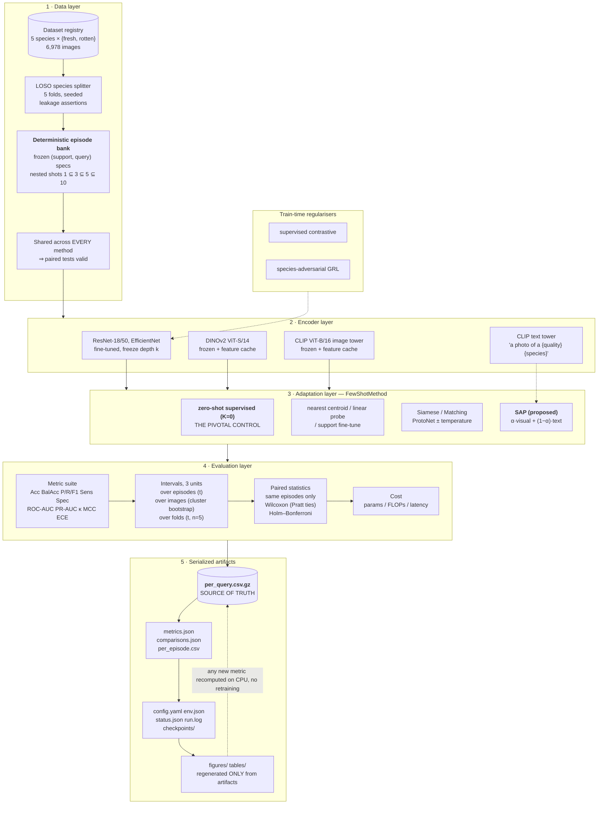

# System architecture

Vector figure for the thesis: `docs/figures/architecture.pdf`
(regenerate with `python scripts/make_architecture_figure.py`).



---

## Component reference

### 1 · Data layer

| Module | Responsibility |
|---|---|
| `fsgrade/data/index.py` | Scan the dataset into a hashable manifest keyed by paths **relative to** `data_root`, so banks are portable across machines. Duplicate and corrupt-file detection. Seeded train/val split of seen species with disjointness assertions. |
| `fsgrade/data/episodes.py` | `FoldSpec` (LOSO / C(5,3) / fixed) and `EpisodeBank`. Episodes are frozen artifacts with a content hash. |
| `fsgrade/data/loaders.py` | Turn specs into tensors. Draws no random numbers, so it is safe with `num_workers > 0`. |

The episode bank is the keystone. Because every method replays byte-identical
episodes, paired statistics become valid and the same model can no longer report
three different numbers for the same test set.

### 2 · Encoder layer

| Module | Responsibility |
|---|---|
| `fsgrade/models/backbones.py` | torchvision backbones + projection head. Carries per-backbone normalisation constants (CLIP and DINOv2 do **not** use ImageNet statistics). |
| `fsgrade/models/freezing.py` | Stage-wise freeze by module identity, with the exact parameter ladder asserted in tests. Also forces frozen BatchNorm into eval mode. |
| `fsgrade/models/foundation.py` | Frozen DINOv2 / CLIP with an on-disk feature cache keyed by the manifest hash, plus the text-prototype builder for SAP. |

### 3 · Adaptation layer

| Module | Responsibility |
|---|---|
| `fsgrade/methods/base.py` | The `FewShotMethod` protocol and the **logits contract**: unbounded, shift-invariant scores. |
| `fsgrade/methods/trained.py` | Zero-shot supervised control, supervised centroid / fine-tune, episodic wrappers. The transfer family shares one checkpoint per fold. |
| `fsgrade/methods/frozen.py` | Cached-feature methods: nearest centroid, linear probe, zero-shot text, **SAP**. |
| `fsgrade/methods/registry.py` | The ordered ladder — single source of truth. |

### 4 · Evaluation layer

| Module | Responsibility |
|---|---|
| `fsgrade/evaluation/metrics.py` | Per-episode and pooled metrics; documents where the two coincide. |
| `fsgrade/evaluation/aggregate.py` | `MeanCI` — an interval cannot exist without `ci_method`, `n`, `unit`. Episode / image / fold aggregations. |
| `fsgrade/evaluation/stats.py` | Paired comparison on shared episodes, Holm–Bonferroni, bootstrap CIs, Cohen's *d*<sub>z</sub>. |
| `fsgrade/evaluation/runner.py` | The evaluation loop; streams predictions to disk as they are produced. |

### 5 · Serialization

`fsgrade/io/results.py` — run directories, atomic JSON writes, and a streaming
CSV writer that flushes periodically so a crashed run leaves partial results
rather than none.

---

## Execution flow

```
0  check_data      validate layout, capacity, duplicates      (CPU, seconds; exits non-zero)
1  build_banks     freeze episodes for every fold             (CPU, seconds)
2  cache_features  one GPU pass per foundation encoder        (optional)
3  evaluate        train + evaluate the ladder, write all     (the long step)
4  stats           paired tests on the shared bank            (folded into step 3)
5  figures/tables  regenerated ONLY from serialized artifacts (CPU)
```

`scripts/run_all.sh` runs these in dependency order; `--smoke` exercises every
code path in minutes on CPU.
